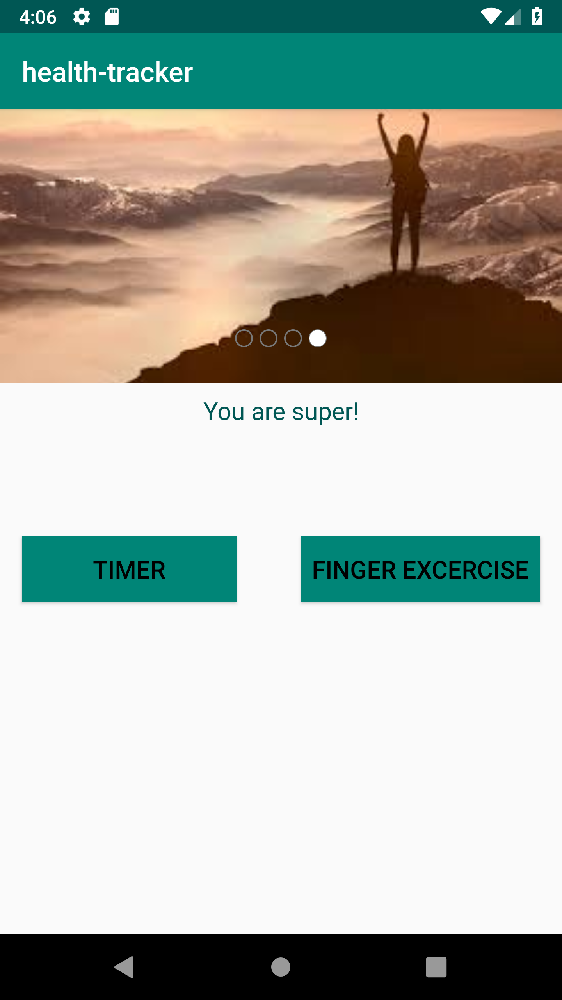
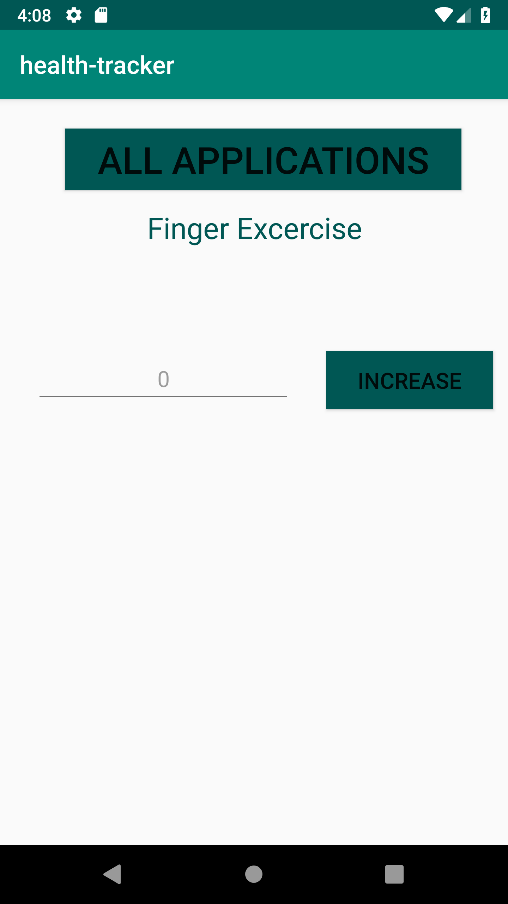
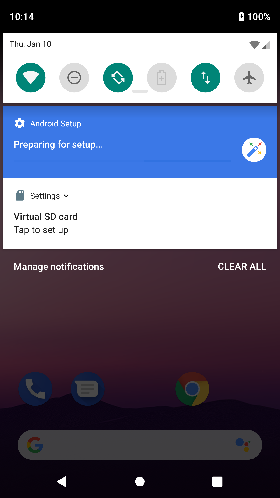
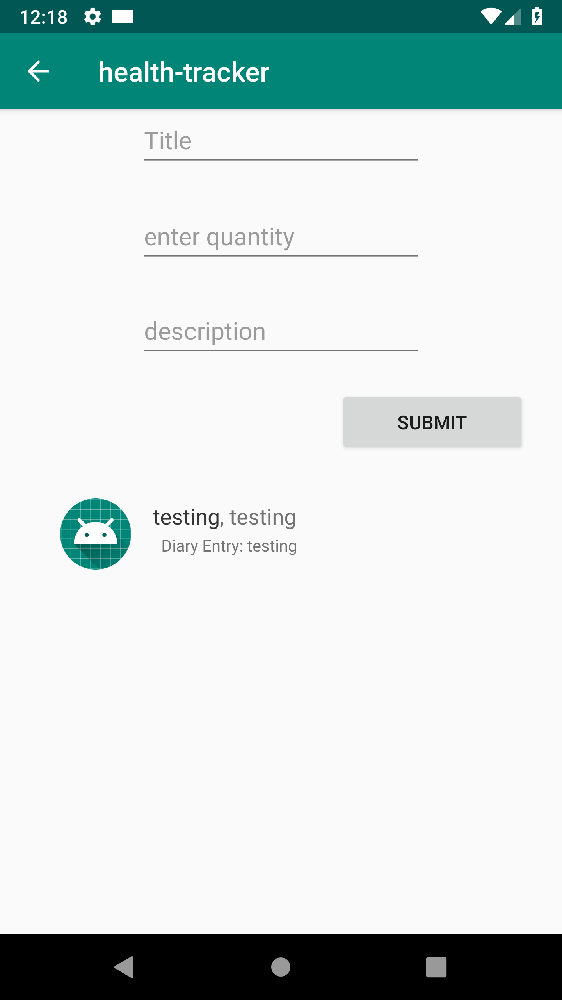
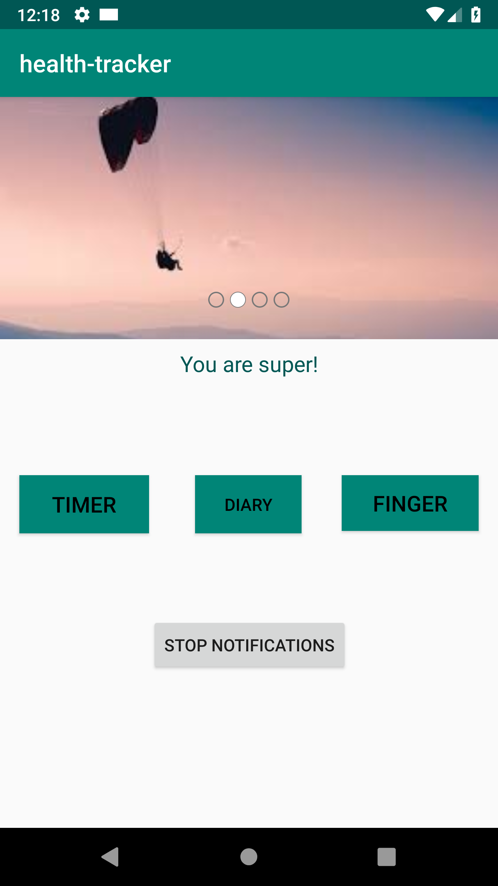
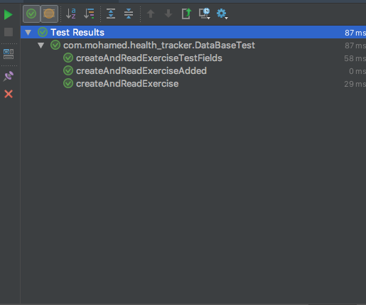
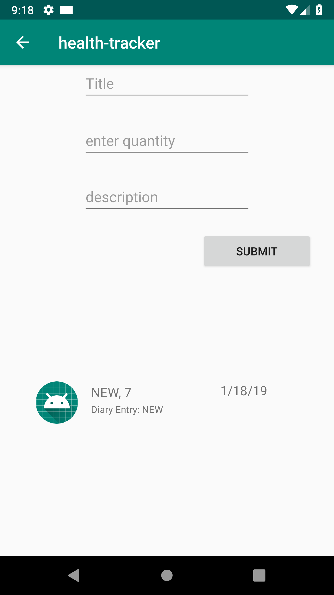

# Feature Tasks: LAB 26 

## Health Tracker app
 
###Finger Exercises
One key part of health is building finger strength and endurance. On the main page, display a number and a button. The number should increase when the button is clicked.

Stretch goal: the app should show encouraging messages as the user passes milestones in their button-clicking (perhaps a message at every 10 clicks, and serious props at every 50).

###Stopwatch
Still on the main page, add a stopwatch. Have a button to [Start/Pause] and [Reset] the clock. The start/pause button should toggle between saying “start” and “pause.” And you should only be able to reset when the stopwatch is paused.

Have the view update as fast as possible while still leaving the buttons responsive.

Display the clock as 0:00:00.000 so it should be able to track up to 9 hours, 59 minutes, 59 seconds and 999 milliseconds.

###Inspiring Image Carousel
At the top of our main page, we want to inspire our users with images of the type of person they can become. Display an image with a caption below it. (The caption should NOT be part of the image; it should be text.) Allow users to cycle through images and read the captions. Pressing next should go to the next image and its caption, pressing prev should go back. The app should display a (1/N), (2/N) … indicator so users know how many items are in the list.

* You may choose the images and captions. Have fun.

* Your app must use a class to model the images and their captions. Use the class to manually instantiate each unique item. Add all of the items to an array.

* Your app should use the array of image objects to cycle through what it’s showing.

# Feature Tasks: LAB 27

Move your Finger Exercises and Stopwatch into their own pages of your app. Add buttons on the homepage to link to those pages, and ensure that the user can use the back button on the device to return to the app homepage. (It’s good practice to include some sort of back button on the page as well.)

Health Notifications
Create a new activity for Notifications. Allow users to set up reminders to drink water, which should appear every 2 hours in the notification bar. (For testing, you might want to shorten this to 15 or 30 seconds.)

Styling
Apply consistent styling across the various Activities in your app. Make sure they have a consistent look and feel, and that buttons are in similar locations on each screen.

# Feature Tasks: LAB 28

### Displaying the Exercise Diary
Add a new Activity to hold the Exercise Diary. In that view, display all entries from the Exercise database in a ListView. (At this point, that should show a single row.) Make sure that Exercise looks reasonable.

### Adding to the Exercise Diary
At the top of the Exercise Diary activity, add a form that allows a user to enter data about an exercise. When they hit submit, the information about that exercise should be stored in the database and displayed in the ListView. You can choose how the timestamp works: either let the user enter when they completed the exercise, or use the time when they hit submit on the form

# Feature Tasks: LAB 29

#### Espresso
Add Espresso tests for all of the Activities we’ve built so far. In particular, the Finger Exercises would benefit from testing, as would the image carousel.

#### Camera
Add the ability for users to enter a profile picture. Give them the option of taking a new photo with the camera, or using images already on their phone. Your app will need to request the appropriate permissions for this. Once users take a profile picture, you should display it on the homescreen

# Feature Tasks: LAB 31
  Backend
  Add a replica of your Exercise model to the backend Spring app. Create a POST route that allows creating a new Exercise, and a GET route that responds with all Exercises currently in the database. Test these routes with Postman, deploy, and ensure there’s at least one Exercise in your deployed db. (This is all easy now… right?)
  
  Android: Display Exercises from the server
  When a user opens the Exercise Diary page, the app should make a request to the server to retrieve all the Exercises in the server’s database. It should display both those Exercises and the ones that are local to the device within the Diary page.
  
  Android: Post Exercises to the server
  When a user creates a new Exercise locally on their device, in addition to saving it to the local database, the app should POST it to the server.

#### Sources for lab26:
* source: https://stackoverflow.com/questions/4597690/android-timer-how-to

# Change Log

Date: 1/10/19:

* Time: 10:00AM
* Description: https://github.com/zahram1087/health-tracker/commit/88970d49c58eb5d952c14c2cda56ecc153ca8a56

* Time : 10:41AM
* Description: updated Readme

* Time : 1:21AM
* Description: https://github.com/zahram1087/health-tracker/commit/ec4a8351c93899258e7b1aadbedc08fbd7842439

Date: 1/14/19

* Time: 10:34AM
* Description: https://github.com/zahram1087/health-tracker/commit/88970d49c58eb5d952c14c2cda56ecc153ca8a56

Date: 1/15/19

* Time: 1:34PM
* Description: https://github.com/zahram1087/health-tracker/commit/ef4fd5da0d9a4ecdc06922e8847890f86d6d87a0

Date: 1/19/19:

* Time: 1:30PM
* Description: https://github.com/zahram1087/health-tracker/commit/52201d5ddfbd7b547859abdf9328bacd44bcf9e6

# screenshots of App Features:

### Screenshots
* HomePage:

  

* FingerExcercise:

  

* Timer:

  

* Notifications:

  

* Diary:

  

* HomePage

  

* activityTests

  

* databasetest

  

* serverAndLocaldataBase

  

